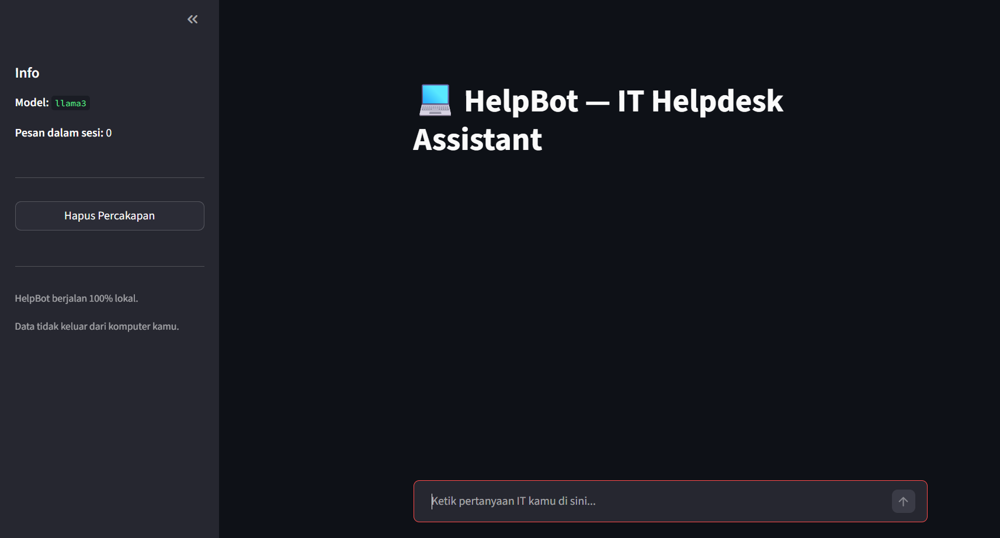

# Chatbot IT Helpdesk (Local AI)

Chatbot internal untuk IT Helpdesk — berjalan **100% lokal** menggunakan Ollama. Data tidak keluar ke internet, gratis, dan full open source.

---

## Tampilan Aplikasi



---

## Stack

| Komponen | Teknologi | Keterangan |
|---|---|---|
| LLM Runtime | Ollama 0.22.0 | Jalankan model AI secara lokal |
| Language | Python 3.11+ | Backend dan logika chatbot |
| Model | llama3 (4.7 GB) | Open source LLM |
| Prototype UI | Streamlit | Web UI cepat untuk testing |
| Production Web | FastAPI | REST API + web app final |
| Config | python-dotenv | Manajemen environment variable |

---

## Roadmap

### Stage 1 — Setup ✅ SELESAI
- [x] Install Ollama (v0.22.0)
- [x] Pull model llama3 (4.7 GB)
- [x] Buat virtual environment Python
- [x] Install dependencies awal
- [x] Test koneksi ke Ollama dari Python (`test_ollama.py`)

### Stage 2 — Basic Chatbot ✅ SELESAI
- [x] Panggil Ollama API dari Python
- [x] Input dari terminal, output ke terminal
- [x] Chat loop dengan conversation history

### Stage 3 — Conversation History ✅ SELESAI
- [x] Simpan riwayat percakapan dalam sesi
- [x] Chatbot bisa ingat konteks pertanyaan sebelumnya

### Stage 4 — IT Helpdesk Persona ✅ SELESAI
- [x] System prompt sebagai IT Helpdesk assistant (HelpBot)
- [x] Chatbot hanya menjawab pertanyaan seputar IT
- [x] Menolak pertanyaan di luar topik IT dengan sopan

### Stage 5 — Streamlit UI ✅ SELESAI
- [x] Web UI dengan Streamlit
- [x] Chat interface (bubble chat)
- [x] Sidebar info: nama model dan jumlah pesan dalam sesi
- [x] Tombol "Hapus Percakapan" untuk reset chat
- [x] Prototype untuk validasi fitur


### Stage 6 — FastAPI ⬜ BELUM MULAI
- [ ] REST API endpoint untuk chat
- [ ] Web UI terintegrasi
- [ ] Dokumentasi API otomatis (Swagger)
- [ ] Siap deploy ke server internal

---

## Cara Menjalankan

### Prasyarat

- [Ollama](https://ollama.com) sudah terinstall dan berjalan
- Python 3.11+

### Install

```bash
# Clone repo
git clone https://github.com/rifki/chatbot-helpdesk-python.git
cd chatbot-helpdesk-python

# Buat virtual environment
python -m venv venv

# Aktifkan venv
# Windows:
.\venv\Scripts\Activate.ps1
# Linux/Mac:
source venv/bin/activate

# Install dependencies
pip install -r requirements.txt

# Buat file konfigurasi
cp .env.example .env
```

### Konfigurasi `.env`

```env
OLLAMA_HOST=http://localhost:11434
OLLAMA_MODEL=llama3
```

### Jalankan

```bash
# Test koneksi ke Ollama
python test_ollama.py

# Jalankan chatbot (terminal)
python chatbot.py

# Jalankan web UI (Streamlit)
streamlit run app.py
```

---

## Struktur Folder

```
chatbot-helpdesk-python/
├── app.py              # Web UI dengan Streamlit
├── chatbot.py          # Chatbot terminal dengan IT Helpdesk persona
├── test_ollama.py      # Script test koneksi ke Ollama
├── requirements.txt    # Python dependencies
├── .env                # Konfigurasi lokal (tidak di-push ke GitHub)
├── .env.example        # Template konfigurasi
└── venv/               # Virtual environment (tidak di-push ke GitHub)
```

---

## Catatan

- Project ini untuk keperluan belajar Python sekaligus membangun tools internal
- Semua model berjalan lokal — tidak ada data yang dikirim ke cloud
- Chatbot menggunakan model llama3 via Ollama, bisa diganti model lain sesuai kebutuhan
